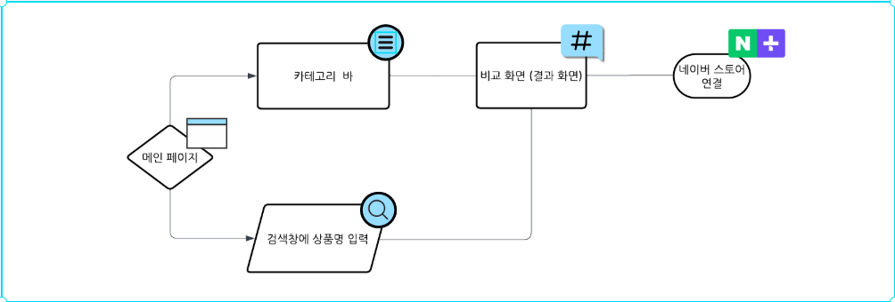
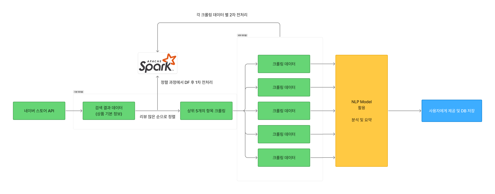
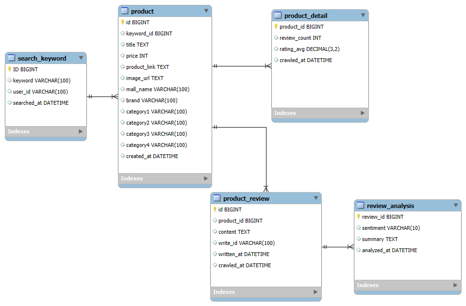

# 🏷️ 리뷰태그 (RevuTag)

**LG U+ Why Not SW 캠프 6기 – RevuTag 팀**

## 📌 프로젝트명

**리뷰 기반 소형 가전제품 특징 비교 및 가격 비교 서비스**

## 📚 프로젝트 개요

온라인 쇼핑이 일상화됨에 따라 소비자들은 제품 구매 전 **리뷰 탐색**을 필수적으로 진행하고 있습니다.
특히 소형 가전제품은 브랜드, 기능, 디자인, 가격 등 **세부 스펙이 다양하고 비교가 복잡**하여 구매 결정이 어려운 품목입니다.

소비자는 방대한 리뷰를 해석하기 어려워 **정보 피로감**을 느끼고, 정확한 판단이 어려워질 수 있습니다.
이에 따라, **리뷰를 자동 분석하여 제품 특징을 시각화하고, 가격 정보와 함께 제공하는 서비스**의 필요성이 증가하고 있습니다.

## 🎯 프로젝트 목적

* 사용자 리뷰에서 **제품 특성 키워드 자동 추출**
* 소형 가전제품 간의 **기능 및 가격 비교 시각화**
* 소비자 의사결정을 돕는 **데이터 기반 쇼핑 지원 서비스** 구축

## 👥 팀 구성

<table>
  <tr>
    <td align="center">
       
      <strong>김동섭</strong> 
      기획서 작성
    </td>
    <td align="center">
       
      <strong>이민진</strong> 
      PPT 제작 및 발표
    </td>
    <td align="center">
       
      <strong>유승주</strong> 
      자료조사 및 리소스 데이터 추출
    </td>
  </tr>
</table>

## 🔎 사용 데이터 및 분석 방법

### 📦 데이터 출처
* **네이버 스토어 API 및 크롤링**
  * 네이버 스토어 API 검색 데이터
  * 세부 크롤링으로 수집한 리뷰 텍스트 데이터
  * 제품 스펙 및 가격 정보

### 🧪 분석 방법

1. **카테고리별 판매량 기반 제품 추출**
2. **분류 모델 및 자연어 처리 모델**
   * 제품별 특성, 감정 태깅
   * 경쟁 제품과의 특징 비교 분석
3. **데이터 시각화**
   * 기능/가격 중심 제품 비교 차트 생성

## 📈 비즈니스 로직 및 Chart
### 🧠 비즈니스 로직
  
메인 페이지에는 사용자 맞춤 광고와 자주 찾는 상품 또는 태그가 노출됩니다.  
사용자는 검색창에 키워드를 입력하거나 햄버거 버튼(카테고리 바)을 클릭해 원하는 제품군으로 진입할 수 있습니다.  
검색된 키워드를 기반으로 유사한 제품들을 비교 화면에 보여주며, 해당 결과를 네이버 스토어 등 외부 링크와 연결하여 사용자에게 구매 옵션을 제공합니다.  
또한, 제품 검색 기록은 추후 분석을 위해 저장됩니다.
### 🔄 데이터 처리 flow
  
사용자가 검색한 키워드를 기준으로 네이버 스토어 API에서 기본 상품 정보를 수집합니다.  
해당 정보는 Apache Spark를 활용하여 정렬 및 전처리 과정을 거친 후, 리뷰 수 등을 기반으로 상위 5개 상품을 선정하여 크롤링을 진행합니다.  
크롤링된 데이터는 NLP 모델을 활용해 핵심 리뷰와 평가 내용을 분석하고 요약합니다.  
최종 분석된 결과는 사용자에게 제공되고, 동시에 데이터베이스에 저장됩니다.
### 📃 ERD

---
## 💰 서비스 구성 요소 및 예상 비용  
| 서비스 구성 요소 | 예상 비용 (월간) |
|------------------|------------------|
| Amazon ECS       | 약 $30.37         |
| Amazon EMR       | **사용 시간에 따라 변동** |
| Amazon RDS       | 약 $30.37         |
| **합계**          | **약 $60.74 + EMR 사용량에 따른 추가 비용** |

1. **Amazon ECS (Elastic Container Service)**

- **용도**: API 서버 및 크롤러 컨테이너 실행
- **인스턴스 유형**: t3.medium (2 vCPU, 4GB 메모리)
- **비용**: 시간당 $0.0416, 월간 약 $30.37  

2. **Amazon EMR (Elastic MapReduce)**
- **용도**: Spark를 이용한 리뷰 데이터 처리
- **인스턴스 유형**: m4.16xlarge (64 vCPU, 256GB 메모리)
- **비용**: EC2 비용 시간당 $3.20 + EMR 비용 시간당 $0.27 = 총 $3.47/h  

3. **Amazon RDS (Relational Database Service)**
- **용도**: 정형화된 데이터 저장
- **인스턴스 유형**: db.t3.medium (2 vCPU, 4GB 메모리)

외에도 NLP를 위한 GPU 서버 비용 등 추가적인 비용이 지출될 수 있다.

## 🌟 기대 효과

* 리뷰 데이터 기반의 **정확한 제품 정보 제공**
* 기업 입장에서 **VOC(고객의 소리)** 분석 활용
* 소비자 피드백 기반 **제품 개선 및 마케팅 전략** 수립

## 🛠️ 고도화
- 회원기능 추가
- 리뷰에 대해 긍정-부정 평가
- 실제적인 데이터 추가 기능 
